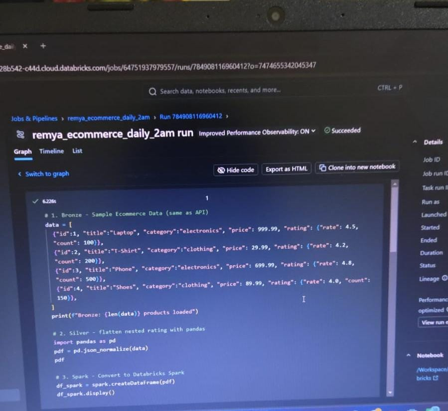

# 🛒 Ecommerce Medallion Pipeline - Databricks

An end-to-end Data Engineering pipeline built on Databricks implementing the Medallion Architecture (Bronze → Silver → Gold) with daily orchestration.

### 🏗️ Architecture
- **Bronze:** Raw JSON ingestion from Ecommerce API (4 products)
- **Silver:** Flatten nested `rating` object using `pandas.json_normalize`
- **Gold:** Aggregated business metrics - Revenue by Category using Spark

### 🛠️ Tech Stack
- Databricks Serverless
- PySpark
- Pandas
- Delta Lake
- Databricks Jobs & Pipelines (Orchestration)

### ⏰ Orchestration
- **Job Name:** `remya_ecommerce_daily_2am`
- **Schedule:** Daily 2:00 AM IST
- **Status:** Production - Runs even when laptop is OFF
- **Last Run:** Succeeded in 6.22s

### 📸 Proof of Execution

#### 1. Job Scheduling & Orchestration Proof
Shows job is scheduled and has 2 successful runs in production.
![Job Schedule Proof]

#### 2. Detailed Run Execution Proof
Shows Succeeded status, execution time 6.226s, and actual Medallion code running on Databricks.
![Detailed Run Succeeded]

### 📂 Files in this Repo
- `remya_ecommerce_databricks.ipynb` - Main pipeline notebook
- `data bricks-job-proof.png` - Orchestration proof
- `job-run-detailed-succeeded.png` - Execution proof

### 👩‍💻 Author
**Remya** - Aspiring Data Engineer
Built with ❤️ on Databricks Community Edition
